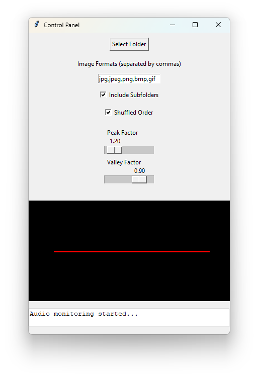

# Song_Slide
Slideshow player that synchronizes image transitions with real-time audio
* Only tested on Windows devices

# Audio-Synced Slideshow Player

This project is a slideshow player that synchronizes image transitions with real-time audio analysis. It supports multiple independent players, ensuring smooth operation even when closing or opening new instances.

## Features
- **Real-time audio analysis**: Detects peaks and adjusts image transitions dynamically.
- **Automatic threshold adjustment**: Sensitivity adapts based on recent history.
- **Hysteresis control**: Prevents excessive image swapping by adjusting dynamically.
- **Multiple independent players**: Run multiple slideshows simultaneously with the same audio.
- **Manual controls**: Fine-tune detection parameters using sliders.

## Screenshot


## Usage

1. Run `song_slide.py`.
2. Click **Select Folder** to choose a directory with images.
3. (Optional) Enable **Subfolders** to include images from subdirectories.
4. (Optional) Enable **Random** to shuffle the image order.
5. Adjust the **Peak Factor** and **Valley Factor** to fine-tune sensitivity.
6. Start playing music, and the slideshow will sync with the detected peaks.

### How It Works
- The program analyzes the audio in real time and detects peaks in volume and frequency.
- The **Peak Factor** controls the sensitivity to peaks (higher values mean fewer detections).
- The **Valley Factor** helps filter out small fluctuations, preventing false triggers.
- When a peak is detected, the image transitions, creating a slideshow synchronized with the music.
- The hysteresis value adjusts dynamically to avoid too many or too few transitions.
- You can run multiple slideshow players simultaneously, each operating independently.

## Installation
Ensure you have Python installed and the required dependencies:

```bash
pip install numpy sounddevice soundcard matplotlib pillow pywin32

